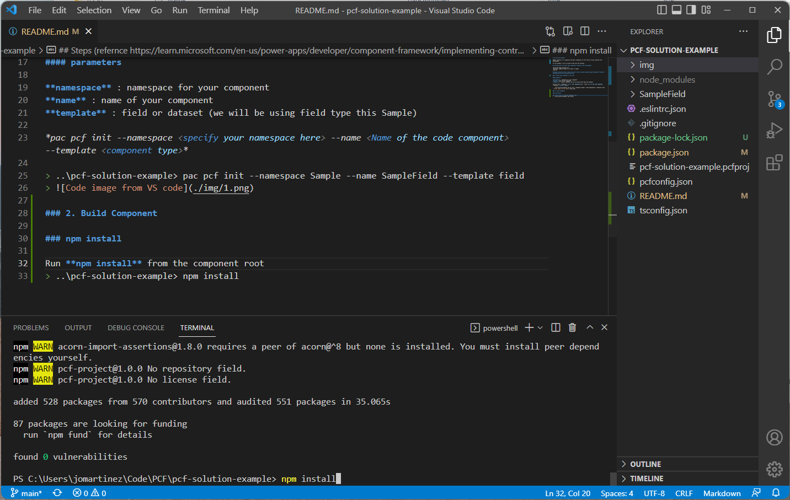
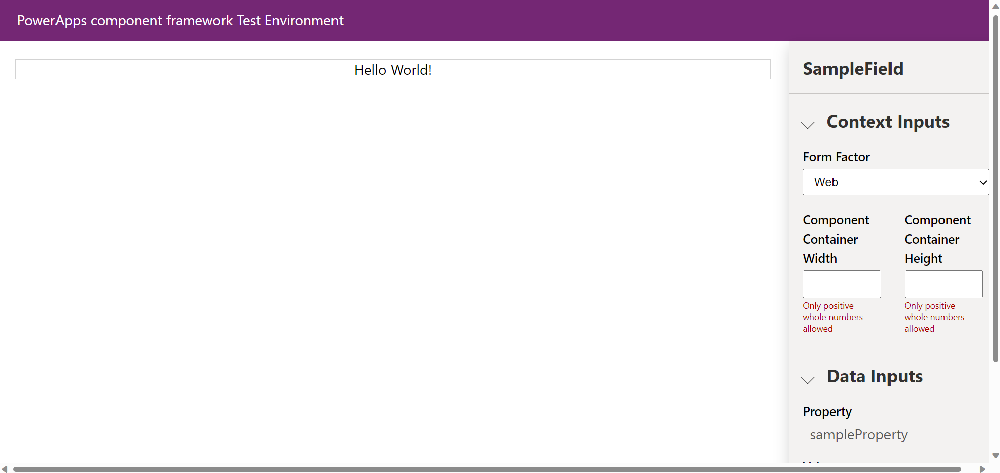

# pcf-solution-example

Sample creation of JS component and React components for PCF control to get kickstart PCF development.

In this example I will be using VS code with the terminal.

## Prerequisites for Power apps Componenet Framework (PCF) development

-Microsoft Power Platform CLI
-Developer Command Prompt for VS 2017 or higher 
-node.js 

## Steps (refernce https://learn.microsoft.com/en-us/power-apps/developer/component-framework/implementing-controls-using-typescript)

### 1.Create code component in CLI tool

#### parameters 

**namespace** : namespace for your component
**name** : name of your component 
**template** : field or dataset (we will be using field type this Sample)

*pac pcf init --namespace <specify your namespace here> --name <Name of the code component> --template <component type>*

Run the following the command to create your component
> ..\pcf-solution-example> pac pcf init --namespace Sample --name SampleField --template field

Navigate to the root folder (this case it is pcf-solution-example)
Run npm install 
> ..\pcf-solution-example> npm install

### 2. Add "Hello World" Content to Component (..\pcf-solution-example\SampleField\index.ts)
Navigate to the component index.ts file and make the following changes to render "Hello World" text in the component

After the class declaration add properties for **context** and **container** 

><code>export class SampleField implements ComponentFramework.StandardControl\<IInputs, IOutputs\> {
>     context : ComponentFramework.Context\<IInputs\>;
>     container : HTMLDivElement;
>     /**
>     * Empty constructor.
>     *\/
></code>

After the **init** function update the component properties and add **'Hello World'** to **container.innerText** value 

`public init(context: ComponentFramework.Context<IInputs>, notifyOutputChanged: () => void, state: ComponentFramework.Dictionary, container:HTMLDivElement): void
    {
        // Add control initialization code
        // Update component properties
        this.context = context;
        this.container = container;

        this.container.innerText = 'Hello World!';
    }`

### 3. Build Component 

Run **npm run build** from the component root
> ..\pcf-solution-example> npm run build

Run **npm run build** from the component root
> ..\pcf-solution-example> npm run build

Run **npm start** to test locally 
> ..\pcf-solution-example> npm start
> 