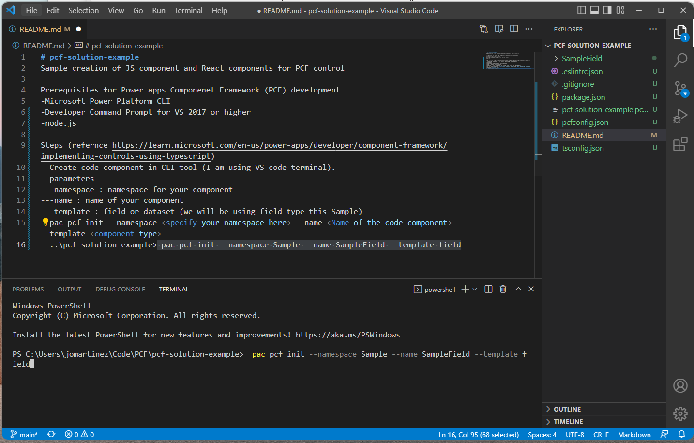

# pcf-solution-example

Sample creation of JS component and React components for PCF control

# Prerequisites for Power apps Componenet Framework (PCF) development

-Microsoft Power Platform CLI
-Developer Command Prompt for VS 2017 or higher 
-node.js 

# Steps (refernce https://learn.microsoft.com/en-us/power-apps/developer/component-framework/implementing-controls-using-typescript)

## 1.Create code component in CLI tool (I am using VS code terminal).

### parameters 

**namespace** : namespace for your component
**name** : name of your component 
**template** : field or dataset (we will be using field type this Sample)

*pac pcf init --namespace <specify your namespace here> --name <Name of the code component> --template <component type>*

> ..\pcf-solution-example> pac pcf init --namespace Sample --name SampleField --template field    
> 